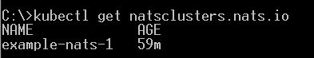
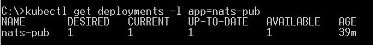
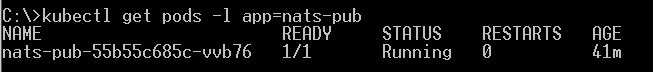
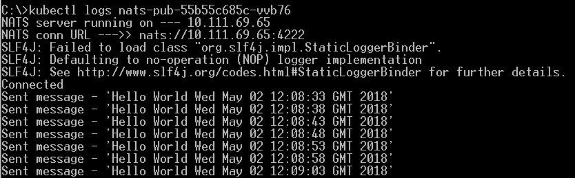
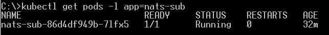
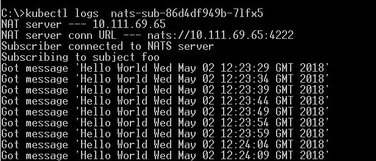

## NATS on Kubernetes example

This example uses [minikube](https://github.com/kubernetes/minikube)

- start Kubernetes - `minikube start`
- create NATS CRD - `kubectl apply -f https://raw.githubusercontent.com/nats-io/nats-operator/master/example/deployment.yaml`
- check `kubectl get crd`

- deploy cluster - `kubectl apply -f https://raw.githubusercontent.com/nats-io/nats-operator/master/example/example-nats-cluster.yaml`
- check `kubectl get natsclusters.nats.io`

- create publisher app deployment - `kubectl create -f nats-pub-deployment.yaml` (will pull image from `https://hub.docker.com/r/abhirockzz/nats-pub/`)

- check `kubectl get deployments -l app=nats-pub`

- locate the pod - `kubectl get pods -l app=nats-pub` ....

- .. and check logs `kubectl logs <pod>`

- create subscriber app deployment - `kubectl create -f nats-sub-deployment.yaml` (will pull image from `https://hub.docker.com/r/abhirockzz/nats-sub/`)

- check `kubectl get deployments -l app=nats-sub`

- locate the pod - `kubectl get pods -l app=nats-sub` ....

- .. and check logs `kubectl logs <pod>`

